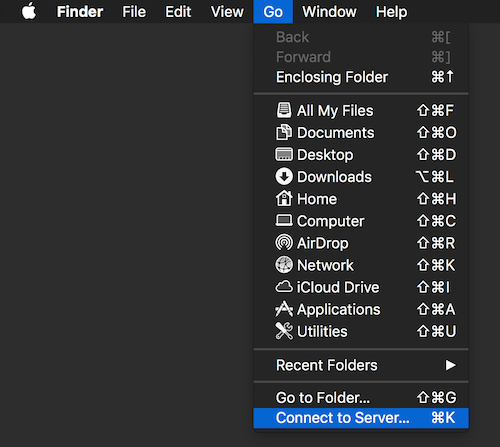
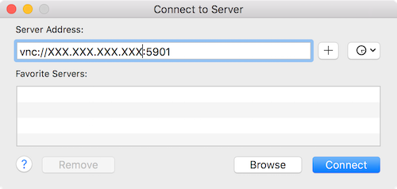
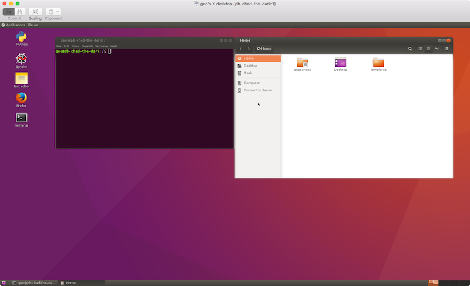

# Connecting to the computer instance

There are basically two steps that you need to do for being able to connect to a remote (cloud) computer instance: (1) Find the 
IP address of the (running) cloud computer instance and (2) connect to it with remote desktop software on your local computer. 

How you connect to the computer instance will depend on 

 - the operating system that you have on your local computer ([Windows](#connect-to-computer-instance-on-windows) / [MacOS](#connect-to-computer-instance-on-macos) / [Linux](#connect-to-computer-instance-on-linux)) 
 - The remote desktop software (or protocol) that you are using
 
Below are instructions how to access the computer instance on different systems (follow the one that you have). 

## Copy the IP address of your computer instance

Everyone will need to do this.
 
You can find the IP address from the Computing Dashboard under the **'Access'** heading.
Select and copy only the numbers. 
We won't be using the rest of the information mentioned there. 
That information is used for taking a specific type of connection (SSH) to the computer using the command prompt.

 

## Connect to computer instance on Windows

On Windows we have two different ways and pieces of software that can be used for connecting the remote computer: **'TightVNC Viewer'** and the **'Remote Desktop Connection'** tool (in finnish 'Etätyöpöytäyhteys').
[The TightVNC Viewer](http://www.tightvnc.com/) is freely available and is an open source remote desktop software that has some nice features, and it is smooth to use.
We will be using this tool in the GIS labs where it is installed on the computers.
If you want, you can also [download](http://www.tightvnc.com/download.php) and install this tool to your own computer. 

[The Remote Desktop Connection](https://support.microsoft.com/en-us/help/17463/windows-7-connect-to-another-computer-remote-desktop-connection) tool is another remote desktop software that comes with every Windows computer.
It is more simple, but has slightly less smooth user experience when compared to TightVNC.
However, it is highly recommendable option since it can be used from any Windows computer (e.g., from the computers in the University's libraries or your own Windows computer) without any additional software installation.

Details on how to connect with both pieces of software are given below.

1. [Connecting with the TightVNC Viewer software](connect-win-vnc.md)
2. [Connecting with the Remote Desktop Connection tool](connect-win-rdp.md)

## Connect to computer instance on MacOS
The preferred way to connect to the computer instances on MacOS is to use the built-in connection tool in **Finder**.

Once the **Connect to Server** window appears, enter the address of the computer instance to connect in the format `vnc://XXX.XXX.XXX.XXX:5901`, replacing the `XXX.XXX.XXX.XXX` with the numbers you selected and copied above in the Computing Dashboard.

At this point you can click **Connect** and enter the password for the connection when prompted (`geoman`).
Now you should see the desktop of your cloud computer!

## Connect to computer instance on Linux

If there are users running Linux, let us know if you're not aware of how to use VNC on your machine and we can help get you connected.
