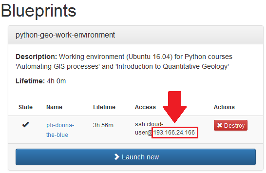

# Connecting to the computer instance

There are basically two steps that you need to do for being able to connect to a remote (cloud) computer instance: (1) Find the 
IP address of the (running) cloud computer instance and (2) connect to it with remote desktop software on your local computer. 

How you connect to the computer instance will depend on 

 - the operating system that you have on your local computer ([Windows](#) / MacOS / Linux) 
 - The remote desktop software (or protocol) that you are using
 
Below are instructions how to access the computer instance on different systems (follow the one that you have). 

## Copy the IP address of your computer instance

Everyone will need to do this.
 
You can find the IP address from the Computing Dashboard under the **'Access'** heading.
Select and copy only the numbers. 
We won't be using the rest of the information mentioned there. 
That information is used for taking a specific type of connection (SSH) to the computer usint the command prompt.

 

## Connect to computer instance on Windows

On Windows we introduce two different ways and softwares that can be used for connecting the remote computer, namely **'TightVNC Viewer'** and a 
**'Remote Desktop Connection'** -tool (in finnish 'Etätyöpöytäyhteys'). [TightVNC Viewer](http://www.tightvnc.com/) is freely available 
and open source remote desktop software that has some nice features and is smooth to use. We will be using this tool in the GIS labs 
where they are installed on the computers. If you want, you can also [download](http://www.tightvnc.com/download.php) and install 
this tool to your own computer. 

[Remote Desktop Connection](https://support.microsoft.com/en-us/help/17463/windows-7-connect-to-another-computer-remote-desktop-connection) -tool is 
another remote desktop software that comes with every Windows computer. It is more simple but has slightly less smooth user experience when in use 
compared to TightVNC. However, it is highly recommendable option since it can be used from any Windows computer 
(e.g. from the computers in the University's libraries or your own Windows computer) without any additional installation.  
  
**1. [Connecting with TightVNC Viewer -software](connect-win-vnc.md)**
 
**2. [Connecting with Remote Desktop Connection -tool](connect-win-rdp.md)**

## 2.2B Connect to computer instance on Mac / Linux
  
  - Add docs here 
