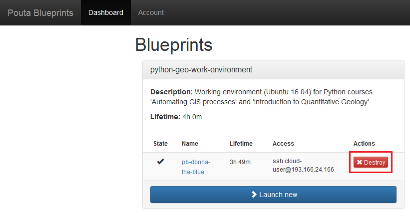

# Destroy instance after you have finished working

After you're done with your work it is **EXTREMELY IMPORTANT** that you have saved your codes and work permanently to your GitHub account. 
If you haven't done so before destroying the instance, **ALL YOUR WORK WILL BE LOST!**

Why are we doing this? The first and biggest motivation is to encourage and push you to learn how to use version control (i.e. Git + GitHib) 
which is extremely useful concept in many ways. The second reason is a more practical one: 
at the moment there is no way to permanently store your codes and data to the 
cloud computing environment that we are using in this course. 

If you haven't yet saved your work to GitHub, do so by following [this documentation](intro-to-github.md).
 
## Destroy instance

If you have saved your work to GitHub, destroy the instance by following these steps:
 
 1. Login to your Computing Dashboard ==> [https://pb.geo.helsinki.fi](https://pb.geo.helsinki.fi)
 2. Destroy the running instance by pressing `Destroy` button
 
 
 
**IMPORTANT NOTICE** The Computer Instance will destroy itself automatically after it's life-time (X hours) has run out. Be sure to save your work before instance is
terminated.
 